# Teleporter reinforcement value in Highlander KOTH

## What this report measures

How much does a teleporter change **when players return to the front**, and what does that mean for **destroying the exit after a wipe**?

This report does two things. **First,** it models baseline teleporter reinforcement value for attackers during dry fights on Product and Ashville. **Second,** it applies those arrival timings to an after-wipe exit destruction policy, used to prevent premature teleporter use during a reset. It compares no usable tele, rebuilt L1, rebuilt L2 and retained L3. The main policy comparison is **keeping a charged L3 versus destroying it and entering the next fight with a ready rebuilt L1**.

The tele is closed during the initial after-wipe rollout. Nobody should use it until the route is safe, so keeping it provides **zero permitted benefit during that period**. The value measured here begins after ground is recovered and players need to return to the fight.

## Short answer

### What a usable tele changes

- **A tele preserves the attacker's respawn advantage at the front.** With equivalent L3 routes, a paired attacker/defender death gives the attacker a **four- or eight-second earlier arrival** under these match settings.
- **Walking can consume most of that advantage.** If we have no usable tele while the defender has L3, the modelled lead becomes -1.4 or +2.6 seconds on Product, and -2.4 or +1.6 seconds on Ashville. The attacker can retain little advantage or even arrive later.
- **Lower levels can preserve the return advantage intermittently; retained L3 can sustain it and create a +2 return advantage.** This compares our returners with the defenders' returning cohort, not the direct L3-versus-L1 comparison below. Retained L3 produces at least four seconds at +2 in five of six multi-player wave scenarios: both alignments with three or four returning players, and one of the two alignments in the two-return model (giving a theoretical 50% chance of +2 when two players per team trade lives).

### What retained L3 adds over ready rebuilt L1

- **A ready rebuilt L1 is just as good as L3 for the first rider, but it needs time to become ready.** After an unassisted exit is placed, the team generally needs about **7-9 seconds of staging or survival before the next relevant death** for the rebuilt L1 to be ready when that player reaches the entrance. Once it is ready, the difference begins when additional players return before L1 has recharged.
- **With two returning attackers, keeping L3 gives a clear advantage over rebuilt L1.** When two attackers return on successive four-second attacking spawn waves, the second return reaches the front 5.4 seconds earlier on Product or 6.4 seconds earlier on Ashville, giving us **+1 front-line player** for that period.
- **With three or four returners, the L3-over-L1 advantage lasts longer and briefly reaches +2.** Retained L3 maintains at least +1 for 9.4 seconds on Product or 10.4 seconds on Ashville, including +2 for 1.4 or 2.4 seconds respectively. The totals are 10.8 p·s on Product and 12.8 p·s on Ashville.

### What this means for the after-wipe policy

- **Destroying the exit removes one immediate misuse risk but can weaken reinforcement later.** It prevents a teammate from using the retained teleporter while the exit is closed or unsafe, potentially dying and delaying the regroup. The relevant comparison is that prevented mistake versus the useful front-line time that retaining L3 is likely to preserve after the route becomes safe.
- **The demos show evidence on both sides.** Manual review found real unsafe or premature tele uses and one probably useful missed reinforcement window after tele destruction. The current evidence does not establish that either blanket rule - always destroy or always retain - is better.

## Reading the numbers

Three quantities must stay separate:

| Quantity or term | Meaning |
|---|---|
| **Modelled return-cohort advantage over defenders** | Difference between modelled returning attackers and returning defenders who have reached the front. A value of +2 means two more returning attackers are present. |
| **Modelled L3 minus L1** | Difference in our returned players between the retained-L3 and rebuilt-L1 alternatives. This is the direct cost of the destruction policy; +2 means L3 has supplied two more players at that moment. |
| **Actual whole-front advantage** | Difference in total front-line players between the teams after including survivors. A value of +2 means our complete front line has two more players. This requires player-position information extracted from demo files, not just the return model. |

**Related terms**

- **Structural reinforcement advantage:** the attacking side's built-in ability to replace deaths faster while the enemy owns the point.
- **Return-wave tempo:** the timing and grouping of those returning players.
- **Front-line player advantage:** the difference between teams in players who have reached the relevant fighting area and can participate. A living player still rolling out from spawn does not count, which is why the HUD alive count cannot answer the teleporter question.

```text
return-cohort advantage at time t
= returned attackers at the front by t
- returned defenders at the front by t
```

The modelled return effect must then be combined with the real whole-front state. If that state is -1 and a retained tele adds two attackers relative to what actually happened, the counterfactual state is +1. That is a two-player **swing**, with an absolute final advantage of +1.

**Player-seconds (p·s)** are the area under that timeline:

```text
1 extra front-line player for 6 seconds = 6 p·s
2 extra front-line players for 4 seconds = 8 p·s
```

Player-seconds provide one compact comparison number. The shape still matters: **+2 for four seconds can be more useful than +1 for eight seconds**, even though both equal 8 p·s.

**Uptime** and **more lives available during a long fight** are other ways the same shorter downtime can appear. For example, 10 seconds fighting plus 10 seconds returning is 50% front-line uptime; 10 seconds fighting plus 20 seconds returning is about 33%. These are interpretations of the same arrival change, so they must not be added again as separate benefits.

A **player trade** means players on opposing teams die. An **Über trade** means both Medics use Über. They are different events.

## Base case and assumptions

**Purpose:** state the choices every result depends on, including when riders will wait for a low-level tele.

| Assumption | Meaning in the model |
|---|---|
| Initial rollout | Tele use is prohibited until the route is called safe; no retention benefit is counted before then. |
| Point state | The enemy still owns the point, so we retain the 4-second attacking wave interval and they retain the 8-second defending interval. The model stops at a capture. |
| Deaths and returns | Attackers and defenders die in paired one-for-one trades. In multi-player cases, one attacker returns on each successive four-second attacking wave. Because defenders use eight-second waves, two corresponding defenders may share the same respawn wave, depending on the wave alignment. Every result row shows the exact spawn offsets. |
| Defender route | The expected case is a defending team that won the previous fight and retained a charged L3 to the chosen front-line endpoint. Cases where the defending Engineer has not completed setup, has died or loses the tele are not modelled. |
| Rebuilt route | L1/L2 is already usable for the first relevant return unless the case says no tele. Construction availability is analysed separately. |
| Player choice | A rider waits at most one second at any tele level; otherwise the player takes the no-tele route. |
| Travel speed | The main routes use a 300-HU/s baseline, shared by Engineer, Pyro and Sniper and close to the unweighted nine-class average (about 299 HU/s). Class-specific movement remains a sensitivity. |
| Fight window | The calculation ends at the last modelled return or earlier if a capture, renewed reset, tele loss or tactical deadline ends the comparison. |

The one-second maximum wait reflects the practical expectation that players will usually start rolling out instead of standing beside a recharging tele. A later rider can still use it after the charge has recovered. Attackers arriving singly four seconds apart do not queue at L3 because its modelled cycle is 3.6 seconds. If two players from the same respawn wave reach the entrance together, one uses a ready tele and the other walks rather than waiting 3.6 seconds.

Changing the maximum wait from one to two seconds does **not** change the L3-versus-L1 policy totals in these scenarios: the relevant L1 waits are at least 2.6 seconds and a simultaneous L3 wait is 3.6 seconds. It changes only the intermediate L2 results, because one recurring L2 wait is 1.6 seconds. The one-second table is retained as the more conservative estimate of actual waiting.

## Timing inputs

**Purpose:** establish the respawn, route, teleporter and rebuild times used by every later calculation.

### Respawn system

The 4- and 8-second values are wave intervals, not complete death-to-spawn times. Under these server settings:

```text
full death-to-spawn time
= 6.4 s death/camera minimum
+ one complete team wave interval
+ 0 to one further wave interval for alignment

Attack:  6.4 + 4 + (0 to 4) = 10.4 to 14.4 s; mean 12.4 s
Defence: 6.4 + 8 + (0 to 8) = 14.4 to 22.4 s; mean 18.4 s
```

| Team state | Wave interval | Full death-to-spawn range | Theoretical mean |
|---|---:|---:|---:|
| Attacking the point | 4 s | **10.4-14.4 s** | **12.4 s** |
| Defending the point | 8 s | **14.4-22.4 s** | **18.4 s** |

The team wave clocks are aligned. For two simultaneous deaths, the defender therefore spawns **4 or 8 seconds** after the attacker, rather than drawing an independent value anywhere in its range. These are the attacker's arrival advantages over the defender, not either player's complete respawn time. Each eight-second defender wave spans two four-second attacker spawn opportunities. The two alignments alternate deterministically with the shared wave clocks; they are not fresh independent coin tosses. A theoretical 50/50 split follows only if paired deaths fall evenly across the two phase bands. The theoretical mean lead is 6 seconds.

> **Demo double-check:** Across 209 near-simultaneous opposing death pairs from 46 demos and 114 rounds under stable point ownership, the scheduled alignment was four seconds for 123 pairs (58.9%) and eight seconds for 86 (41.1%); the mean was **5.65 seconds**. Product had 68/113 four-second alignments (60.2%); Ashville had 55/96 (57.3%). One Ashville-final2 pair's recorded spawns were 3.105 seconds apart because the attacker spawned about 0.9 seconds after the four-second wave. It remains a four-second alignment, not a third alignment.<br/><br/>Same-tick deaths produced 20/25 four-second alignments (80.0%); the other pairs produced 103/184 (56.0%). Within 30 seconds of the latest capture, 51/78 were four-second alignments (65.4%), compared with 72/131 later pairs (55.0%). Pairs with an ownership change between death and respawn were excluded. Fight cadence may explain some of the skew, but the audit does not establish the cause. The visible KOTH point timer did not reveal a practical "die at timer X" rule. Because events cluster within matches, the audit confirms the possible alignments but does not establish a universal alignment probability.

Point captures while a player is dead and different server settings can change a particular result. Sources: [Valve respawn implementation](https://github.com/ValveSoftware/source-sdk-2013/blob/master/src/game/shared/teamplayroundbased_gamerules.cpp#L3100) and [death-camera defaults](https://github.com/ValveSoftware/source-sdk-2013/blob/master/src/game/server/player.cpp#L87).

### Travel, teleporter and rebuild timings

The travel measurements are approximate **300-HU/s baseline routes** to the same chosen front-line endpoint. They were measured as Engineer for convenience, but the speed is also shared by Pyro and Sniper and is close to the unweighted average across all nine classes (about 299 HU/s).

| Input | Product | Ashville |
|---|---:|---:|
| **No-tele rollout from spawn to front** | **~12.0 s** | **~12.0 s** |
| Spawn to tele entrance | ~2.0 s | ~2.0 s |
| Transfer allowance (see Appendix) | 0.6 s | 0.6 s |
| Exit to front | ~4.0 s | ~3.0 s |
| **L3 rollout from spawn to front** | **6.6 s** | **5.6 s** |
| **L3 saving over no-tele rollout** | **5.4 s** | **6.4 s** |

Nominal recharge is 10, 5 and 3 seconds at L1, L2 and L3. Including the transfer state gives approximate rider cycles of **10.6, 5.6 and 3.6 seconds**. The first rider of a ready tele has no recharge wait. Source: [Valve teleporter implementation](https://github.com/ValveSoftware/source-sdk-2013/blob/master/src/game/server/tf/tf_obj_teleporter.cpp#L36).

Observed replacement exits took about **16.8-21.1 seconds on Product** and **19.4-21.1 seconds on Ashville**, depending on assistance. About 21.1 seconds is the useful unassisted estimate after placement. The total outage can be longer because the Engineer must reach the placement location, may have other duties, may die, or may destroy and rebuild again.

For an unassisted L1 to be ready when the fastest attacking return reaches the entrance, the first relevant death must occur no sooner than about **8.7 seconds after placement** (`21.1 s construction - 10.4 s death-to-spawn - 2.0 s spawn-to-entrance`). Using the mean attacking death-to-spawn time gives a threshold of about **6.7 seconds** (`21.1 s construction - 12.4 s death-to-spawn - 2.0 s spawn-to-entrance`).

> **The 7-9 second staging rule.** After an unassisted replacement exit is placed, the team generally needs roughly **7-9 seconds of staging or survival before the next relevant death** for the rebuilt L1 to be ready when that player reaches the entrance. If someone dies sooner, keeping the existing tele (modelled here as retained L3) is more likely to help that first returner.

<pagebreak>

## How faster respawns become faster reinforcements

**Purpose:** help readers understand the completed model by adding one factor at a time: exact wave alignment, route loss scenario, rebuild timing and shared queues. Readers who only want the results can skip to **Applying the completed model**.

### 1. Start with one average simultaneous player trade

On Product, with both teams using charged L3s, the full spawn-to-front journey takes a total of **6.6 seconds**: about 2.0 seconds to the entrance, 0.6 seconds to transfer and 4.0 seconds from exit to front. This is the journey duration; the saving over the 12.0-second walking route is **5.4 seconds**.

In the lines below, every value after **at** is a timestamp. Brackets give the route and total travel duration.

```text
Attacker: dies at 0.0 -> respawns at 12.4 -> front at 19.0 (charged L3: 6.6 s travel)
Defender: dies at 0.0 -> respawns at 18.4 -> front at 25.0 (charged L3: 6.6 s travel)

Average result: attacker is at the front alone for 6.0 s = +6.0 p·s
```

This is the simple explanation of the structural reinforcement advantage. Equal tele routes preserve the average six-second spawn lead.

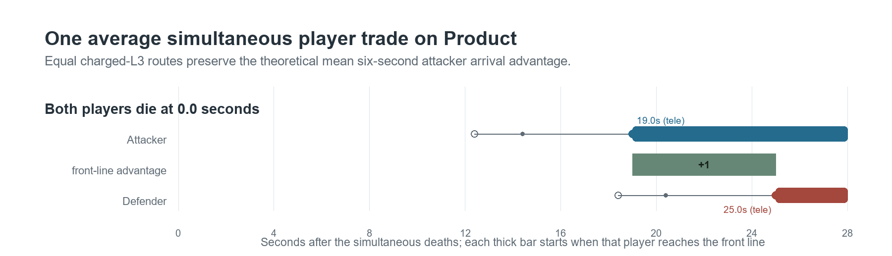

<pagebreak>

### 2. Replace the average with the two exact wave alignments

The six-second figure is an average of two wave alignments. These example deaths both occur at time 0.0:

```text
Alignment producing a 4-second gap:
Attacker: respawns at 10.4 -> front at 17.0 (L3: 6.6 s)
Defender: respawns at 14.4 -> front at 21.0 (L3: 6.6 s)
Result: +1 attacker for 4.0 s = +4.0 p·s

Alignment producing an 8-second gap:
Attacker: respawns at 14.4 -> front at 21.0 (L3: 6.6 s)
Defender: respawns at 22.4 -> front at 29.0 (L3: 6.6 s)
Result: +1 attacker for 8.0 s = +8.0 p·s
```

An individual paired trade therefore produces four or eight seconds, not six.

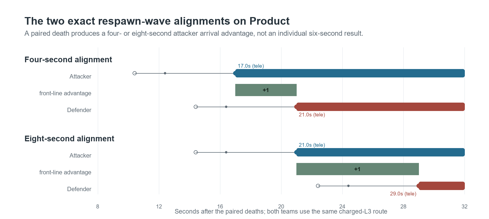

<pagebreak>

### 3. Make the attacker use no-tele rollout

The defender still uses L3. On Product, no-tele rollout adds 5.4 seconds to the attacker's route compared with L3:

```text
4-second case:
Attacker: respawns at 10.4 -> front at 22.4 (walk: 12.0 s)
Defender: respawns at 14.4 -> front at 21.0 (L3: 6.6 s)
Attacker lead: 21.0 - 22.4 = -1.4 s

8-second case:
Attacker: respawns at 14.4 -> front at 26.4 (walk: 12.0 s)
Defender: respawns at 22.4 -> front at 29.0 (L3: 6.6 s)
Attacker lead: 29.0 - 26.4 = +2.6 s
```

In the 4-second case, the defender reaches the front 1.4 seconds first. In the 8-second case, the attacker still arrives 2.6 seconds first. On Ashville the tele route saves 6.4 seconds rather than Product's 5.4, so subtracting that route loss from the four- and eight-second spawn leads produces **-2.4 or +1.6 seconds**.

This is why an unavailable attacking tele can consume most of the structural advantage even though the attacker still has the faster respawn timer.

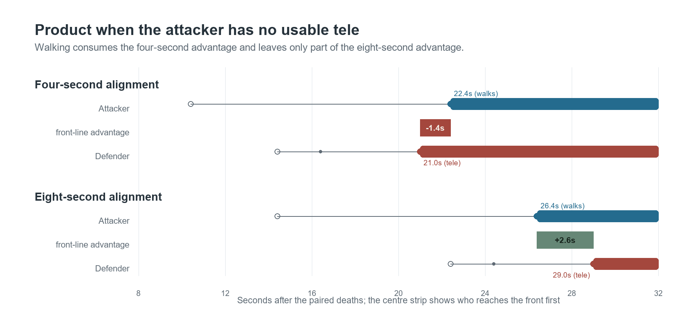

<pagebreak>

### 4. Account for the reset and rebuild timeline

Retention gives no permitted service while the tele is closed. The relevant question is whether a replacement is usable when the **first relevant returning player reaches the entrance**, not whether its 21-second construction started at the wipe.

If the exit is placed during the end of rollout or staging, construction can overlap buffs, a planned delay, the opening of the dry fight and the next player's death-to-spawn time. A ready L1 may therefore be a realistic first-return case. If the Engineer is delayed or dies, the first return instead becomes a no-tele case.

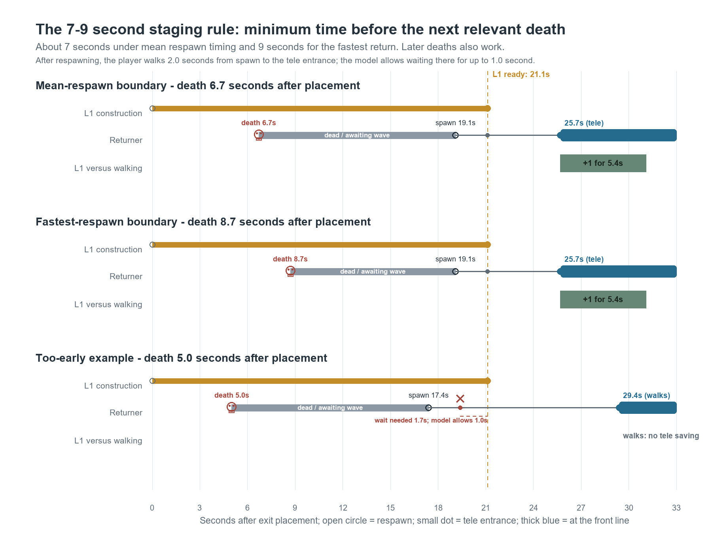

The chart uses exit placement as time 0. The 7-9 second figure is a **minimum delay**, not a window: `6.7 + 12.4 + 2.0 = 21.1 seconds` with mean death-to-spawn timing, and `8.7 + 10.4 + 2.0 = 21.1 seconds` for the fastest return. Later deaths also leave enough construction time. In the too-early example, the required 1.7-second wait exceeds the model's one-second limit, so the player walks.

> **Additional timing note — entrance upgrades during resets:** after the exit is destroyed, the entrance is disconnected. An Engineer who respawns early during a reset can use that time at spawn to upgrade it before moving to the staging area and placing the next exit. In the usual reset, sac wave, reset, dry-fight sequence, the reset after the sac can provide another entrance-upgrade opportunity. These opportunities may allow L2 or L3, but they shrink if the Engineer respawns with the team or is occupied building Über with the Medic. The reset provides entrance-upgrade time; it does not shorten exit construction. The exact death order, metal availability and entrance-upgrade timing were not reconstructed.

<pagebreak>

### 5. Add several deaths and one shared tele

The first rider of a ready L1, L2 or L3 receives the same immediate service. Later riders expose the level difference:

- L3 cycles in about 3.6 seconds, faster than the 4-second attacking spawn waves.
- L2 cycles in about 5.6 seconds and can fall slightly behind successive attacking waves.
- L1 cycles in about 10.6 seconds. Later players often reach the front sooner by no-tele rollout.
- Defenders can spawn together on the 8-second wave. Under the one-second maximum wait, one uses a ready L3 while the other takes the no-tele route. The generic count model does not assign class priority; a team may deliberately give Heavy the tele.

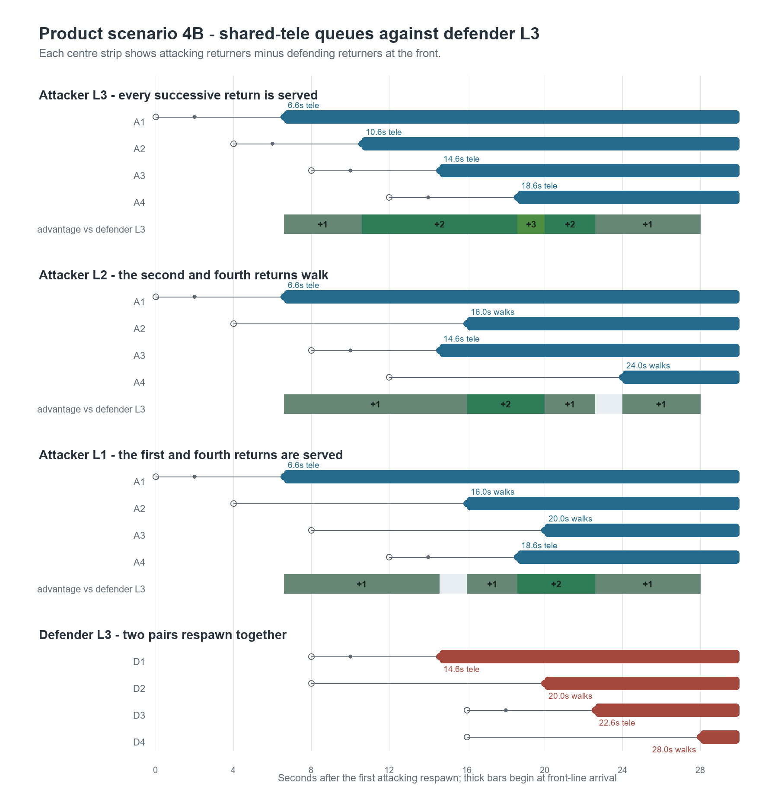

<pagebreak>

### 6. Work the two-player Product example completely

Scenario 2B uses attack spawn offsets `0, 4` and defence offsets `8, 8`. The fixed 10.4 seconds before the first attacking spawn is omitted from every line because it changes no comparison.

```text
Retained L3 attackers
A1: spawn at 0.0 -> tele entrance at 2.0 -> front at 6.6 (L3)
A2: spawn at 4.0 -> tele entrance at 6.0 -> front at 10.6 (L3)

Defender L3
D1: spawn at 8.0 -> tele entrance at 10.0 -> front at 14.6 (L3)
D2: spawn at 8.0 -> front at 20.0 (walk: 12.0 s)
    (using L3 would require a 3.6 s wait at the tele entrance)

Return-cohort timeline with retained L3
6.6-10.6:  +1 for 4.0 s = 4.0 p·s
10.6-14.6: +2 for 4.0 s = 8.0 p·s
14.6-20.0: +1 for 5.4 s = 5.4 p·s
Total:                        17.4 p·s
```

With a ready rebuilt L1, A1 still arrives at 6.6. A2 would need to wait 6.6 seconds at the tele entrance, beyond the one-second maximum wait, so A2 takes the 12-second no-tele route and arrives at 16.0:

```text
Rebuilt-L1 return-cohort timeline
6.6-14.6:  +1   for 8.0 s = 8.0 p·s
14.6-16.0: even for 1.4 s = 0.0 p·s
16.0-20.0: +1   for 4.0 s = 4.0 p·s
Total:                        12.0 p·s
```

This one scenario now gives three different, correct statements:

- **Against the defending return cohort:** retained L3 reaches +2 for 4.0 seconds.
- **Keeping L3 instead of rebuilding L1:** A2 is present 5.4 seconds earlier, so the direct policy gain is +1 for 5.4 seconds = **+5.4 p·s**.
- **For the whole front line:** retained L3 supplies one additional earlier player; add that player to the real pre-existing margin to determine the resulting team advantage.

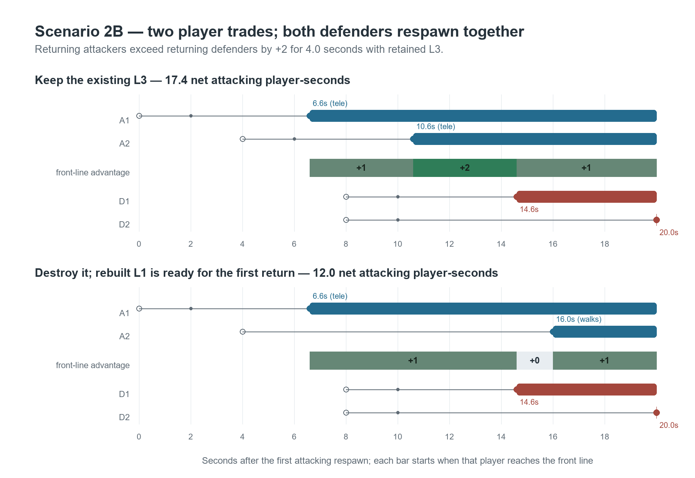

*The hollow dots mark spawns, thin lines mark travel/queue time, small muted dots mark tele-entrance arrival, and solid coloured dots mark front-line arrival. The centre strip shows the return-cohort advantage over defenders.*

### 7. Extend the same rules to every case

The tables below repeat exactly the same process for one to four paired trades and both possible 4/8-second wave alignments. In the multi-player cases, attackers return one at a time at offsets `0, 4, 8, 12`; this is not a model of several attackers respawning together. Defenders follow the eight-second wave and can return together. No new mechanic is introduced after the two-player example.

<pagebreak>

## Applying the completed model

**Purpose:** compare complete return timelines, first for the destruction decision itself and then against the defending return cohort.

### What we lose by destroying L3 and rebuilding L1

**How many more of our returning attackers are at the front when the old L3 is kept than when it is destroyed and replaced by L1?** Defenders and surviving players are identical in the two alternatives and therefore do not affect this comparison.

In the later main tables, **A is the four-second defender gap and B is the eight-second defender gap**. A is the less favourable alignment for attackers and appears first. A/B changes the attacker-versus-defender margin. However, the same defender arrivals appear in both of our policy alternatives—keep L3 and rebuild L1—so they cancel when those alternatives are compared. Our attacker arrival times depend on our tele state and are identical in A and B. The direct-policy table therefore needs only one row per return count. The totals assume no earlier tactical cutoff.

**1 p·s = one additional player at the front for one second.**

| Map | Paired returns per side | Extra front-line presence from keeping L3 rather than ready L1 | Total |
|---|---:|---|---:|
| Product | 1 | No difference | **+0.0 p·s** |
| Product | 2 | 5.4 s at +1 | **+5.4 p·s** |
| Product | 3 | 4.0 s at +1<br>1.4 s at +2<br>4.0 s at +1 | **+10.8 p·s** |
| Product | 4 | 4.0 s at +1<br>1.4 s at +2<br>4.0 s at +1 | **+10.8 p·s** |
| Ashville | 1 | No difference | **+0.0 p·s** |
| Ashville | 2 | 6.4 s at +1 | **+6.4 p·s** |
| Ashville | 3 | 4.0 s at +1<br>2.4 s at +2<br>4.0 s at +1 | **+12.8 p·s** |
| Ashville | 4 | 4.0 s at +1<br>2.4 s at +2<br>4.0 s at +1 | **+12.8 p·s** |

*Player-seconds are a summary. A short +2 window can matter more than a longer +1 window with the same area.*

Under the one-second wait rule, the second and third L1 riders in this fixed four-wave sequence walk instead of queueing. By the fourth spawn, L1 has recharged and serves that rider immediately, so the fourth return adds no further L3-over-L1 player-seconds here. This is why the three- and four-return totals can match.

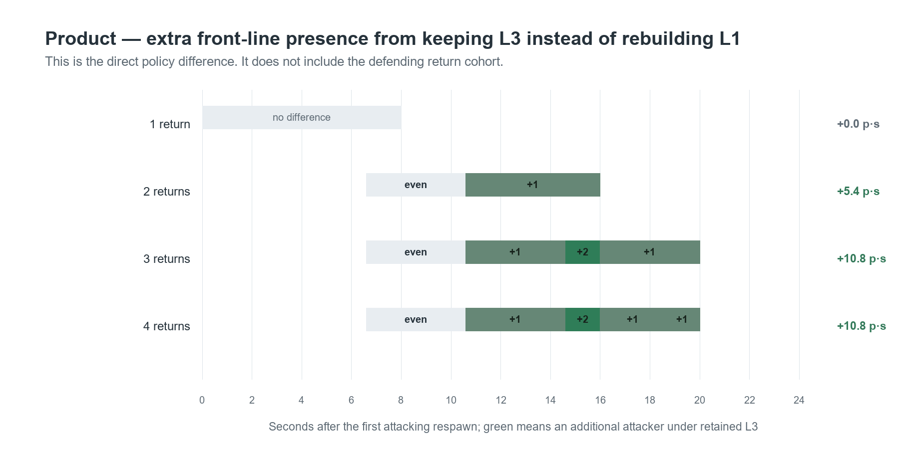

### Main Product comparison: all cases and teleporter states

This is the main comparison table. **A means the defender's first return is four seconds behind; B means it is eight seconds behind.** Each infrastructure cell shows the return-cohort advantage over defenders in chronological order, followed by net player-seconds. The column order is no tele, rebuilt L1, rebuilt L2 and retained L3; L3 and L1 are highlighted because they are the primary policy comparison.

| Case | Attack spawn offsets | Defence spawn offsets | No tele | **Rebuild L1** | Rebuild L2 | **Keep L3** | **Extra from keeping L3 (vs L1)** |
|---:|---|---|---|---|---|---|---:|
| **1A** | `0` | `4` | **1.4 s of -1**<br>*(-1.4 p·s)* | **4.0 s of +1**<br>*(+4.0 p·s)* | **4.0 s of +1**<br>*(+4.0 p·s)* | **4.0 s of +1**<br>*(+4.0 p·s)* | **+0.0 p·s** |
| **1B** | `0` | `8` | **2.6 s of +1**<br>*(+2.6 p·s)* | **8.0 s of +1**<br>*(+8.0 p·s)* | **8.0 s of +1**<br>*(+8.0 p·s)* | **8.0 s of +1**<br>*(+8.0 p·s)* | **+0.0 p·s** |
| **2A** | `0, 4` | `4, 12` | **1.4 s of -1**<br>**4.0 s even**<br>**2.6 s of +1**<br>*(+1.2 p·s)* | **4.0 s of +1**<br>**5.4 s even**<br>**2.6 s of +1**<br>*(+6.6 p·s)* | **4.0 s of +1**<br>**5.4 s even**<br>**2.6 s of +1**<br>*(+6.6 p·s)* | **12.0 s of +1**<br>*(+12.0 p·s)* | **+5.4 p·s** |
| **2B** | `0, 4` | `8, 8` | **2.6 s of +1**<br>**1.4 s even**<br>**4.0 s of +1**<br>*(+6.6 p·s)* | **8.0 s of +1**<br>**1.4 s even**<br>**4.0 s of +1**<br>*(+12.0 p·s)* | **8.0 s of +1**<br>**1.4 s even**<br>**4.0 s of +1**<br>*(+12.0 p·s)* | **4.0 s of +1**<br>**4.0 s of +2**<br>**5.4 s of +1**<br>*(+17.4 p·s)* | **+5.4 p·s** |
| **3A** | `0, 4, 8` | `4, 12, 12` | **1.4 s of -1**<br>**4.0 s even**<br>**2.6 s of +1**<br>**1.4 s even**<br>**4.0 s of +1**<br>*(+5.2 p·s)* | **4.0 s of +1**<br>**5.4 s even**<br>**2.6 s of +1**<br>**1.4 s even**<br>**4.0 s of +1**<br>*(+10.6 p·s)* | **4.0 s of +1**<br>**4.0 s even**<br>**1.4 s of +1**<br>**2.6 s of +2**<br>**5.4 s of +1**<br>*(+16.0 p·s)* | **8.0 s of +1**<br>**4.0 s of +2**<br>**5.4 s of +1**<br>*(+21.4 p·s)* | **+10.8 p·s** |
| **3B** | `0, 4, 8` | `8, 8, 16` | **2.6 s of +1**<br>**1.4 s even**<br>**6.6 s of +1**<br>*(+9.2 p·s)* | **8.0 s of +1**<br>**1.4 s even**<br>**6.6 s of +1**<br>*(+14.6 p·s)* | **9.4 s of +1**<br>**4.0 s of +2**<br>**2.6 s of +1**<br>*(+20.0 p·s)* | **4.0 s of +1**<br>**9.4 s of +2**<br>**2.6 s of +1**<br>*(+25.4 p·s)* | **+10.8 p·s** |
| **4A** | `0, 4, 8, 12` | `4, 12, 12, 20` | **1.4 s of -1**<br>**4.0 s even**<br>**2.6 s of +1**<br>**1.4 s even**<br>**6.6 s of +1**<br>*(+7.8 p·s)* | **4.0 s of +1**<br>**5.4 s even**<br>**4.0 s of +1**<br>**4.0 s of +2**<br>**2.6 s of +1**<br>*(+18.6 p·s)* | **4.0 s of +1**<br>**4.0 s even**<br>**1.4 s of +1**<br>**2.6 s of +2**<br>**8.0 s of +1**<br>*(+18.6 p·s)* | **8.0 s of +1**<br>**9.4 s of +2**<br>**2.6 s of +1**<br>*(+29.4 p·s)* | **+10.8 p·s** |
| **4B** | `0, 4, 8, 12` | `8, 8, 16, 16` | **2.6 s of +1**<br>**1.4 s even**<br>**6.6 s of +1**<br>**1.4 s even**<br>**4.0 s of +1**<br>*(+13.2 p·s)* | **8.0 s of +1**<br>**1.4 s even**<br>**2.6 s of +1**<br>**4.0 s of +2**<br>**5.4 s of +1**<br>*(+24.0 p·s)* | **9.4 s of +1**<br>**4.0 s of +2**<br>**2.6 s of +1**<br>**1.4 s even**<br>**4.0 s of +1**<br>*(+24.0 p·s)* | **4.0 s of +1**<br>**8.0 s of +2**<br>**1.4 s of +3**<br>**2.6 s of +2**<br>**5.4 s of +1**<br>*(+34.8 p·s)* | **+10.8 p·s** |

`p·s` means player-seconds. **Extra from keeping L3 (vs L1)** is the direct policy gain; the other infrastructure columns compare the attackers' return cohort with the defenders' return cohort. Positive values favour attackers and negative values favour defenders.

*Player-seconds are a summary. Read the +1/+2 durations in the cell before judging equal totals.*

### Main Ashville comparison: all cases and teleporter states

The Ashville table uses the same layout and assumptions. Equal tele routes cancel when both corresponding riders use them, but a defender may walk when two defenders share one charged L3. Ashville's shorter exit-to-front route can therefore change retained-L3 totals as well as walking and low-level queue results.

| Case | Attack spawn offsets | Defence spawn offsets | No tele | **Rebuild L1** | Rebuild L2 | **Keep L3** | **Extra from keeping L3 (vs L1)** |
|---:|---|---|---|---|---|---|---:|
| **1A** | `0` | `4` | **2.4 s of -1**<br>*(-2.4 p·s)* | **4.0 s of +1**<br>*(+4.0 p·s)* | **4.0 s of +1**<br>*(+4.0 p·s)* | **4.0 s of +1**<br>*(+4.0 p·s)* | **+0.0 p·s** |
| **1B** | `0` | `8` | **1.6 s of +1**<br>*(+1.6 p·s)* | **8.0 s of +1**<br>*(+8.0 p·s)* | **8.0 s of +1**<br>*(+8.0 p·s)* | **8.0 s of +1**<br>*(+8.0 p·s)* | **+0.0 p·s** |
| **2A** | `0, 4` | `4, 12` | **2.4 s of -1**<br>**4.0 s even**<br>**1.6 s of +1**<br>*(-0.8 p·s)* | **4.0 s of +1**<br>**6.4 s even**<br>**1.6 s of +1**<br>*(+5.6 p·s)* | **4.0 s of +1**<br>**6.4 s even**<br>**1.6 s of +1**<br>*(+5.6 p·s)* | **12.0 s of +1**<br>*(+12.0 p·s)* | **+6.4 p·s** |
| **2B** | `0, 4` | `8, 8` | **1.6 s of +1**<br>**2.4 s even**<br>**4.0 s of +1**<br>*(+5.6 p·s)* | **8.0 s of +1**<br>**2.4 s even**<br>**4.0 s of +1**<br>*(+12.0 p·s)* | **8.0 s of +1**<br>**2.4 s even**<br>**4.0 s of +1**<br>*(+12.0 p·s)* | **4.0 s of +1**<br>**4.0 s of +2**<br>**6.4 s of +1**<br>*(+18.4 p·s)* | **+6.4 p·s** |
| **3A** | `0, 4, 8` | `4, 12, 12` | **2.4 s of -1**<br>**4.0 s even**<br>**1.6 s of +1**<br>**2.4 s even**<br>**4.0 s of +1**<br>*(+3.2 p·s)* | **4.0 s of +1**<br>**6.4 s even**<br>**1.6 s of +1**<br>**2.4 s even**<br>**4.0 s of +1**<br>*(+9.6 p·s)* | **4.0 s of +1**<br>**4.0 s even**<br>**2.4 s of +1**<br>**1.6 s of +2**<br>**6.4 s of +1**<br>*(+16.0 p·s)* | **8.0 s of +1**<br>**4.0 s of +2**<br>**6.4 s of +1**<br>*(+22.4 p·s)* | **+12.8 p·s** |
| **3B** | `0, 4, 8` | `8, 8, 16` | **1.6 s of +1**<br>**2.4 s even**<br>**5.6 s of +1**<br>*(+7.2 p·s)* | **8.0 s of +1**<br>**2.4 s even**<br>**5.6 s of +1**<br>*(+13.6 p·s)* | **10.4 s of +1**<br>**4.0 s of +2**<br>**1.6 s of +1**<br>*(+20.0 p·s)* | **4.0 s of +1**<br>**10.4 s of +2**<br>**1.6 s of +1**<br>*(+26.4 p·s)* | **+12.8 p·s** |
| **4A** | `0, 4, 8, 12` | `4, 12, 12, 20` | **2.4 s of -1**<br>**4.0 s even**<br>**1.6 s of +1**<br>**2.4 s even**<br>**5.6 s of +1**<br>*(+4.8 p·s)* | **4.0 s of +1**<br>**6.4 s even**<br>**4.0 s of +1**<br>**4.0 s of +2**<br>**1.6 s of +1**<br>*(+17.6 p·s)* | **4.0 s of +1**<br>**4.0 s even**<br>**2.4 s of +1**<br>**1.6 s of +2**<br>**8.0 s of +1**<br>*(+17.6 p·s)* | **8.0 s of +1**<br>**10.4 s of +2**<br>**1.6 s of +1**<br>*(+30.4 p·s)* | **+12.8 p·s** |
| **4B** | `0, 4, 8, 12` | `8, 8, 16, 16` | **1.6 s of +1**<br>**2.4 s even**<br>**5.6 s of +1**<br>**2.4 s even**<br>**4.0 s of +1**<br>*(+11.2 p·s)* | **8.0 s of +1**<br>**2.4 s even**<br>**1.6 s of +1**<br>**4.0 s of +2**<br>**6.4 s of +1**<br>*(+24.0 p·s)* | **10.4 s of +1**<br>**4.0 s of +2**<br>**1.6 s of +1**<br>**2.4 s even**<br>**4.0 s of +1**<br>*(+24.0 p·s)* | **4.0 s of +1**<br>**8.0 s of +2**<br>**2.4 s of +3**<br>**1.6 s of +2**<br>**6.4 s of +1**<br>*(+36.8 p·s)* | **+12.8 p·s** |

*Player-seconds are a summary. The table assumes the rebuilt tele is ready for the first relevant return; an unfinished tele adds a separate first-rider availability loss.*

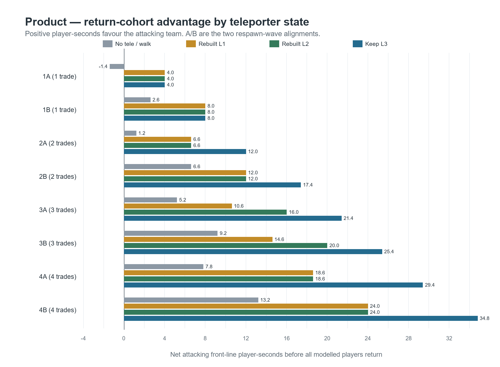

## Applying this to the after-wipe policy

**Purpose:** identify when the transport value begins and how rebuilding overlaps the reset, staging and next fight.

A team may adopt an after-wipe destruction policy to prevent a teammate from riding a closed or unsafe exit, dying, and delaying the regroup. The tradeoff is losing the retained exit's reinforcement value once the route becomes safe.

**The deletion decision is made during the reset. Its cost, if any, appears in the fight that follows.** The relevant sequence is:

1. We lose a fight or finish a sac wave, reset and close the tele.
2. Under the destruction policy, the Engineer deletes the exit, preferably before teammates respawn.
3. The team rolls out without using the tele.
4. The Engineer places a replacement near the end of rollout or during staging.
5. Once ground is recovered and the route is safe, the retained exit could serve returns. The replacement may still be under construction; if complete, it may be only L1 or L2.
6. Players die during the next fight. The tables measure how these different tele states change their arrival times.

A sac can become the relevant dry fight if the enemy Medic dies and enough teammates survive to continue. If this happens before a replacement is ready, retained L3 can serve the first return once its route is safe. A late spawner can also use retained L3 to catch up after the team has recovered ground. In both cases, the benefit is the time gained before that player can participate in a useful fight.

The model establishes the transport difference. The demo evidence below asks whether a useful fight window overlapped that difference, and what unsafe use of a retained tele actually cost.

## What the demo files show

**Purpose:** test which modelled opportunities overlapped real fights and distinguish unsafe tele use from an automated tele-then-death flag.

### Respawn timing double-check

Across 209 near-simultaneous pairs, the scheduled team-wave alignments were four or eight seconds. One attacking player's recorded spawn occurred about 0.9 seconds after its applicable wave, so that pair's player spawn events were 3.105 seconds apart. The audit classifies it as a four-second scheduled alignment. The alignment mean was 5.65 seconds.

### Unsafe-use candidates

Forty-six recordings with active rounds were screened, covering about 16 hours 7 minutes and 1,934 friendly tele uses. The destruction policy was implemented after August 18, so the August 18 match is included in the earlier period.

| Period | Recordings | Active play | Friendly tele uses | Reset-like uses | Death within 5 s | Rapid-death screens reviewed |
|---|---:|---:|---:|---:|---:|---:|
| Through Aug 18 | 34 | 11 h 46.5 min | 1,418 | 41 | 6 | 6 / 6 |
| After Aug 18 policy implementation | 12 | 4 h 20.8 min | 516 | 3 | 1 | 1 / 1 |
| **Total** | **46** | **16 h 7.3 min** | **1,934** | **44** | **7** | **7 / 7** |

The five-second column is a screening result, not seven proven mistakes. Manual visual review classified the seven rapid-death scenes listed below and one non-death unsafe-use control described after the table. Across those eight scenes, it found two harmful known-reset uses, three other deaths after premature or transition-period uses with different policy implications, one unsafe known-reset use that survived, and two ambiguous or legitimate continuations. These scenes should not be compressed into a single misuse count.

Of the 44 reset-like uses, 10 occurred while the team's Medic was alive and moving away from spawn with a nearby teammate, with recent combat activity also detected. These signals may indicate that the fight was continuing, but they can also appear during a prohibited after-wipe rollout. The 10 cases therefore require manual review and are not classified as confirmed reset mistakes from position data alone.

| Demo scene | Tele-use tick | Recorded outcome | Manual visual classification |
|---|---:|---|---|
| Jun 24 Product, demo 1469910 | **16645** at 4:09.67 | Heavy dies 2.12 s later, deals 253 damage and trades with Pyro. | Ambiguous coordination/continuation; not a clear reset misuse. |
| Jul 30 Product, demo 1485728 | **5601** at 1:24.02 | Demo dies 2.07 s later with no damage. | **Clear harmful reset misuse:** enemy Soldier was already near the exit. |
| Jul 30 Product, demo 1485728 | **74880** at 18:43.20 | Engineer dies 2.76 s later with no damage. | Team was moving to staging; exit used about 2-3 s before the area was secured. |
| Aug 1 Product, demo 1486538 | **65430** at 16:21.45 | Engineer dies 3.25 s later and deals 78 damage. Soldier had used L2 at tick 65022 and died before the Engineer's ride. | **No reset call was made; a near-wipe continued as a fight.** With only Sniper initially forward, the team was close to resetting; respawns then produced even players or player advantage and the team moved out. Engineer used the route before it was secure. Premature and punished, but not a confirmed closed-reset misuse. |
| Aug 7 Ashville, demo 1489376 | **63522** at 15:52.83 | Heavy dies 0.80 s later; all seven other non-Spy teammates are near spawn. | **Clear harmful known-reset use;** possibly an intentional lobby gamble. |
| Aug 18 Ashville, demo 1494495 | **58505** at 14:37.57 | Demo dies 1.97 s later with no damage. | Likely attempted Medic rescue/continuation; reset timing was unclear. |
| Sep 9 Ashville, demo 1503848 | **125874** at 31:28.11 | Medic dies 3.36 s later and acknowledges the mistake. | Premature use before lobby was secure during a fast dry-push rollout; no reset call was made. |

An active-fight control shows why the screen does not classify every tele-then-death event as a reset misuse. In July 30 Product, demo 1485728, Engineer used L3 at **tick 64995 / 16:14.92**; viewing around tick 65190 shows Heavy and Medic holding rock. Engineer was then sniped while running up at **tick 65337**, 5.13 seconds after the ride. The audit correctly marked this use as neither a strict nor broad reset candidate. It is not one of the eight reviewed scenes above.

A second control is Aug 18 Ashville, demo 1494495 at **tick 35921 / 8:58.81**: the same Demoman survives about 122 seconds after what visual review identifies as a clear unsafe known-reset use. A Sniper watched lobby and a Soldier nearly killed him. A death-only metric therefore undercounts unsafe uses, while a position-only metric overcounts legitimate continuations.

The Sep 9 Ashville recording, demo 1503848, adds a clear premature rollout use. Medic used L1 at **tick 125874 / 31:28.11** while most teammates were dead or only beginning to roll out, intending to reunite on bats for a fast dry push. Lobby was not secure; Medic immediately acknowledged that taking the tele was wrong and died 3.36 seconds later. The recording review indicates little charge was lost and suggests a several-second push delay, but does not establish an exact delay. The seven later rides below establish subsequent use of the same connection; their effect on the result remains a modelled alternative to what happened.

### One connection: an unsafe use, then seven later rides

After the Medic's death, the enemy captured at **31:36.54 / tick 126436**. Our connection remained and was upgraded. It carried seven friendly rides before our recapture at **32:51.87 / tick 131458**, a 75.33-second attacking interval:

| Tele-use time | Tick | Rider | Level |
|---|---:|---|---:|
| 31:37.88 | 126525 | Heavy | L2 |
| 31:47.46 | 127164 | Medic | L3 |
| 32:00.60 | 128040 | Demo | L3 |
| 32:19.90 | 129327 | Heavy | L3 |
| 32:23.60 | 129573 | Demo | L3 |
| 32:36.19 | 130413 | Engineer | L3 |
| 32:41.19 | 130746 | Medic | L3 |

These are seven rides by four players, including Medic's return after the mistake. Heavy/Demo rides were **3.69 seconds apart**, and Engineer/Medic rides **5.00 seconds apart**. Both fit the modelled L3 cycle; an unchanged L1 or L2 would not serve each pair at those same times. Players might instead walk, or an upgrade could refresh a lower-level tele's charge.

> The same connection enabled an immediate mistake and then carried repeated reinforcements. Seven uses demonstrate demand; they do not demonstrate seven useful arrival advantages or prove that the tele won the recapture.

This is why a feed cannot be assessed alone. Deleting the exit would remove that use if done in time, but its later availability and level would also need to be included in the comparison.

### Potential earlier-return opportunities after tele destruction

This is an automated screening step, not a judgement of tactical usefulness. For each recorded destruction, it estimates when returning players could have reached the front if retained L3 had remained available once the route was safe. This modelled alternative to what happened is called a counterfactual.

The screen examined 42 operational tele destructions across twelve later recordings. It waited until four non-Spy teammates had recovered ground before allowing retained-tele benefit, required that support immediately before each modelled ride, excluded the closed rollout, and clipped each ride at capture, that player's next death or restoration of the tele pair. Nine destruction episodes contained at least one potentially earlier attacking return:

```text
51.94 aggregate seconds with one extra attacker
 5.84 aggregate seconds with two extra attackers
------------------------------------------------
51.94 x 1 + 5.84 x 2 = 63.62 potential player-seconds
(across nine separate episodes)
```

This is **not one continuous 63.62-second fight** and does not assume one unchanged Über state. It is the sum of separate modelled windows. It holds later deaths and tele safety fixed, and the position rule can remain open across staging, route changes and a second reset. It is an audit screen for possible cost, not measured useful combat presence.

The specific examples below were reviewed manually to judge whether a modelled earlier arrival overlapped useful play. They provide stronger tactical context than the automated screen, but they still cannot prove what would have happened under the unchosen policy.

The largest concentration is August 22 Ashville, demo 1496366. An L3 was destroyed at **tick 98650 / 24:39.75**. The four-player ground screen was satisfied at **tick 100228 / 25:03.42**, and a usable tele pair returned at **tick 107172 / 26:47.58**. Five recorded respawns produced modelled earlier-arrival windows totalling 33.93 p·s.

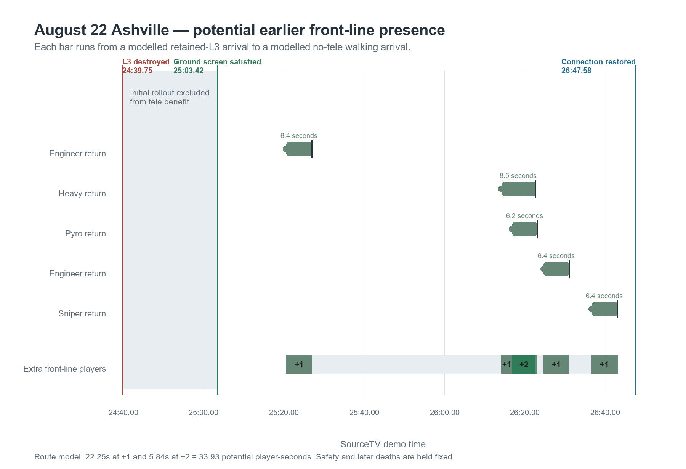

*Each coloured bar begins at the modelled retained-L3 front-line arrival and ends at the modelled no-tele walking arrival. The bottom strip counts how many additional attackers the retained-L3 counterfactual supplies over what happened. During the overlapping Heavy/Pyro interval, the recorded non-Spy whole-front margin was about -1; adding two earlier arrivals makes the counterfactual about +1. That is a two-player swing and an absolute +1 state.*

The generic route model gives 5.84 seconds at +2. A position-based check shortens that overlap to about **3.6-3.9 seconds** because the recorded Heavy and Pyro crossed the audit's front-line threshold sooner than the generic rollout model predicted. Manual review finds that this particular overlap was probably useful: the recorded front was roughly -1 while the enemy pressured point, and two earlier arrivals would have changed it to roughly +1. Later in the outage, retained L3 could have brought Sniper back about 6.4 seconds earlier. That would not have changed the next action because the team finished moving to its bats staging position at about the same time he arrived by walking. This is why the 33.93 p·s raw total should not be reported as 33.93 seconds of useful combat advantage.

A Product construction example shows a long outage without a demonstrated tactical loss. In the September 6 demo, the L2 exit was placed at **tick 34433 / 8:36.50**, finished its roughly 21-second construction at about **tick 35841 / 8:57.62**, was active for about two seconds, then was destroyed at **tick 35978 / 8:59.67**. The next tele pair was unavailable for roughly 37 seconds, including the first 13.7 seconds after the next Über deployment at **tick 37535 / 9:23.02**. Despite that outage, manual review found no useful missing return during the immediate sac/reset action. A later L2 could have helped separated Demo/Engineer returns, but the recording does not show a missed decisive arrival.

The other September 6 scenes are also qualifications, not headline proof. One sac converted into a dry fight after the enemy Medic dropped, but the team already controlled the space and won with little further fighting. One final contest ended before possible Demo/Scout returns could matter. In a later Product round-three grass-door contest, the enemy held forward on grass while the team tried to break in. The planned entry sent the power classes through concrete first, with the Engineer following. A retained exit might have offered an alternate Engineer point touch or distraction, but it was unlikely to change the result.

## Decision factors: what favours keeping or destroying

**Purpose:** sort the practical factors by which policy they favour. Several can apply at once, and none decides the policy by itself.

### Favours keeping the exit

- **The route becomes safe before the next useful return.** A retained L3 can serve later returns as soon as the route is called safe, without waiting for a separate rebuild.
- **A player dies late or respawns behind the group.** The team can move forward and take staging ground while that player is dead. Retained L3 can then help the returner catch up without delaying the coordinated push as much. This matters when the group can leave before the returner; if the plan is to wait anyway, the tele does not accelerate the group's departure.
- **Several useful returns are close together.** L3 can keep at least +1 over ready L1 for 9.4 seconds on Product or 10.4 seconds on Ashville in the three- and four-return sequences.
- **No replacement is usable yet.** Retained L3 can serve even the first useful return. At the 300-HU/s baseline, walking instead adds about 5.4 seconds on Product or 6.4 seconds on Ashville. Placing the exit late in staging, completing staging quickly or losing a player during staging makes this situation more likely.
- **The retained exit is harder to destroy.** A Level 3 teleporter has 216 health, compared with 150 at Level 1, so it survives more spam and gives the Engineer more time to remove a Sapper.
- **The Engineer needs metal for other buildings.** Keeping avoids the normal 50-metal exit rebuild. From a 200-metal spawn, rebuilding leaves 150 metal: enough for one mini-sentry, but not a second after the first is destroyed. It can also delay a Dispenser.
- **A sac converts into a dry fight, or a partial wipe continues.** If the enemy Medic dies while enough teammates survive, the sac can continue directly as a dry fight. Another player may then die before a replacement L1 is ready; a closed retained exit can serve that return once its route becomes safe.
- **A useful fight deadline is close.** An earlier Heavy, Pyro, Demo, Medic or other needed class can matter before the decisive exchange, an overtime contest or a point touch.
- **The missing player is slow or especially important.** The tele can save more time for slow classes and can avoid blast-jump damage while preserving fresh-spawn healing readiness.
- **Teammates reliably obey the closed-tele call.** Discipline can preserve the later transport value while avoiding a premature use.
- **A premature use would have limited consequences.** The resulting death may cost little time if it neither delays the planned departure nor leaves the team without a player it needs.
- **The exit may survive or distract.** It can occupy enemy attention, remain available if the forward hold breaks sooner than expected, or survive until space is recovered.
- **The fight may last through repeated returns.** Shorter downtime can increase front-line presence across several lives and preserve healing readiness on later spawns.

### Favours destroying the exit

- **The exit is visibly unsafe and someone is likely to use it.** Destroying removes this retained connection's immediate misuse risk when a teammate may ignore the call, misread the ground state or gamble on a camped exit.
- **A misuse would cost meaningful time.** Destruction matters more when it prevents a death that would extend the regroup, delay the next push or make the player miss a time-sensitive fight.
- **A replacement is likely to be ready before anyone needs transport.** This is more plausible when the team expects roughly 7-9 seconds after placement before another death. The normal death-to-spawn and spawn-to-entrance time can then complete the construction window before that player reaches the entrance.
- **Only one useful rider is expected, or returns are widely spaced.** Ready L1 serves the first rider as fast as L3 and can recover before the next. If players arrive together, one charged tele cannot serve all of them immediately.

<pagebreak>

- **An early Engineer respawn can reduce the rebuild penalty.** When the Engineer respawns early during a reset, he can use the waiting time to upgrade the entrance before moving to staging and placing the next exit. In the usual reset, sac wave, reset, dry-fight sequence, the reset after the sac may provide a second upgrade opportunity. This depends on the Engineer's respawn timing and other duties; it can improve the level of the next connection but does not shorten exit construction. A well-timed level upgrade can also refresh a lower-level tele's charge after one ride, allowing another player through sooner.
- **The affected class has a fast alternative route.** Scout speed, Soldier or Demo jumps, another spawn door or a different route can reduce the value of the retained connection.
- **The enemy is likely to remove the exit first.** Keeping adds little if the enemy will destroy it before a useful return or the team is unlikely to recover that route in time.

### Changes how much either choice matters

- **The live game state may not fit one clean label.** A reset can become a continuation, a sac can become a dry fight, and staging can overlap active combat. The policy must follow what is actually happening.
- **Actual player choices can differ from the model.** The model assumes a player uses the tele only when it is expected to reach the front sooner and requires no more than one second of waiting; otherwise the player walks. Real players may ignore the tele, choose a route the exit does not serve or wait longer.
- **Point ownership limits the calculation.** The model stops at capture because the respawn relationship reverses. Teams may delay capture to avoid denying their own fast spawns; post-capture play is outside the report.
- **Earlier presence is only potential value.** Health, heals, class, position, focus fire, support and fight timing determine whether an earlier player contributes.
- **Earlier arrival can preserve critical-heal readiness and allow an additional return during a long fight.** Taking the tele can preserve the fresh-spawn critical-heal ramp by avoiding blast-jump damage. During a long fight, shorter downtime may allow a player to die, respawn and rejoin before the fight ends. These are consequences of the saved arrival time, not separate gains to add to the player-second total.

## How to judge the policy

**Purpose:** turn the model and selected demo evidence into a decision rule without pretending the reviewed scenes measure a misuse rate.

**Compare only the consequences caused by the choice.** If deletion prevents an unsafe use, estimate the regroup or push delay that death would have caused. If retention enables an earlier return, count the saved time when it advances the push or overlaps a useful fight. An earlier arrival during staging still matters if it lets the push begin sooner.

For example, the July 30 Demo death may have added only about four seconds to the regroup because Heavy was already a late required spawn. The exact increment depends on when the team would otherwise have departed. The September 9 rollout mistake may also have delayed the push by several seconds, but no exact estimate is established.

Unsafe uses are not all prevented by the same policy. A clearly closed exit, an intentional gamble, and a route taken slightly before ground is secure require different judgements. A rebuilt tele can also be used prematurely. The September 9 scene had no reset call, so a rule triggered only by that call would not necessarily have prevented it.

The eight scenes were selected for review, not sampled randomly. Their counts establish that these situations occurred; they do not measure the chance of misuse per reset or the expected benefit of deleting an exit. The active-Medic flag also indicates context, not a measured probability of a valid continuation.

## Conclusion: when keeping or destroying helps

Teleporters turn earlier respawns into earlier front-line presence. With equivalent routes, attackers retain their four- or eight-second spawn lead. With no attacking tele against defender L3, the modelled lead becomes approximately **-1.4 or +2.6 seconds on Product** and **-2.4 or +1.6 seconds on Ashville**.

For two to four paired returns, retaining L3 instead of ready L1 adds **5.4-10.8 Product p·s** or **6.4-12.8 Ashville p·s**, assuming a player will wait no more than one second for a teleporter to recharge. These are earlier-front-line-presence gains under the stated assumptions. They do not measure a fixed increase in win probability.

| If this is the situation... | ...then the practical implication is |
|---|---|
| The exit is unsafe now, but teammates reliably obey the closed-tele call and the usual staging ground is likely to be recovered soon. | **Favour keeping the otherwise useful L3 alive but closed.** Reopen it when the ground is safe; this preserves first-rider speed and later capacity. |
| The old exit was destroyed, then the route becomes safe while its replacement is still unavailable. | **This is the clearest cost of deletion.** A retained exit could serve the first useful return immediately; until the replacement is active, the destroyed alternative is effectively no tele. |
| Only one player returns and a charged rebuilt L1 is ready. | **Little direct transport cost from rebuilding.** First-rider service is equal; any prevented consequential misuse can favour destruction. |
| The enemy visibly controls or camps the exit, and a teammate is likely to use it despite the closed call. | **Favour destruction.** The immediate rider risk is concrete. Enemy control alone is less decisive because a retained exit can still distract or survive until recovery. |
| Several useful returns are expected close together after the route becomes safe. | **Favour keeping L3 when rider discipline is reliable.** L3 serves the cluster; under the one-second rule, low-level riders often walk instead of waiting. |
| Both consequential misuse and useful clustered returns are plausible. | **Neither side is established as better by these data.** Compare the expected prevented loss with the useful arrival windows surrendered. |
| The action will end before any saved return can arrive, or the enemy will almost certainly destroy the exit first. | **Little immediate reinforcement cost from deletion.** The surviving exit may still create a distraction, so that secondary value remains situational. |

The safety problem is real: manual review found two harmful known-reset uses, several punished premature or transition-period uses, and an unsafe use that survived. Retention also has demonstrated transport value and a probably useful Heavy/Pyro opportunity in the August 22 fight. These observations do not establish that every feed would be prevented by deletion or that every saved arrival changes the fight.

**Practical recommendation:** keep an otherwise useful exit alive but closed when the team can reliably avoid it until the ground is safe. Destroy it when a specific, visible risk of consequential misuse outweighs the likely returns lost afterward. This is a decision rule based on the tradeoffs above, not a measured victory for either blanket policy.

> A wipe starts the decision; it does not settle it. Judge the mistake that deletion is likely to prevent against the useful reinforcement time that keeping the exit is likely to preserve.

## Reproducibility and limits

**Purpose:** state what the report can and cannot prove and point to the files needed to reproduce the calculations.

The report uses SourceTV event times and sampled player/building positions. SourceTV does not contain team voice calls, exact player intent or a complete geometric test of exit safety. Front-line position is map- and fight-specific. Demo counterfactuals hold recorded deaths and later decisions fixed; retaining a tele could change those later events.

The calculations and source data are in:

- [`research/report_model.mjs`](research/report_model.mjs) and [`research/report_model.json`](research/report_model.json): return-wave scenarios and p·s totals.
- [`research/respawn_pair_audit.mjs`](research/respawn_pair_audit.mjs) and [`research/respawn_pair_audit.json`](research/respawn_pair_audit.json): paired-death respawn double-check.
- [`research/demo_frontline_case.mjs`](research/demo_frontline_case.mjs) and [`research/demo_frontline_case.json`](research/demo_frontline_case.json): August 22 Ashville position sensitivity.
- [`research/historical_findings.md`](research/historical_findings.md): recording audit, candidate uses and later destruction screen.
- [`research/manual_demo_review_findings.md`](research/manual_demo_review_findings.md): tactical classifications supplied after watching the review scenes.
- [`research/report_figures.py`](research/report_figures.py): generated figures.

<pagebreak>

## Appendix: expanded Product scenario timelines

These figures show the same four paired trades under the two defender-wave alignments. In **4A**, the first defender return is four seconds behind the first attacking return. In **4B**, it is eight seconds behind. The less favourable 4A alignment appears first. Each figure compares no tele, rebuilt L1, rebuilt L2 and retained L3 against defender L3.

### Product scenario 4A - four-second defender alignment

The earlier first defender return makes this the less favourable alignment for attackers. The no-tele case briefly falls to one fewer returning player at the front; retained L3 stays ahead throughout the shown return window.

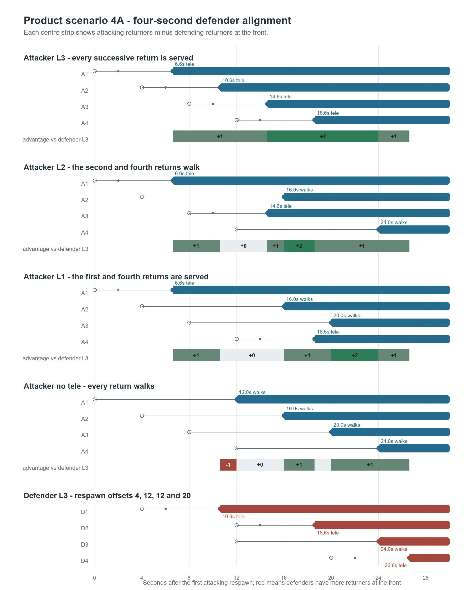

<pagebreak>

### Product scenario 4B - eight-second defender alignment

The later first defender return lets every attacker state establish an initial front-line advantage. Retained L3 serves all four successive attacking returns; lower levels and no tele create gaps in that advantage.

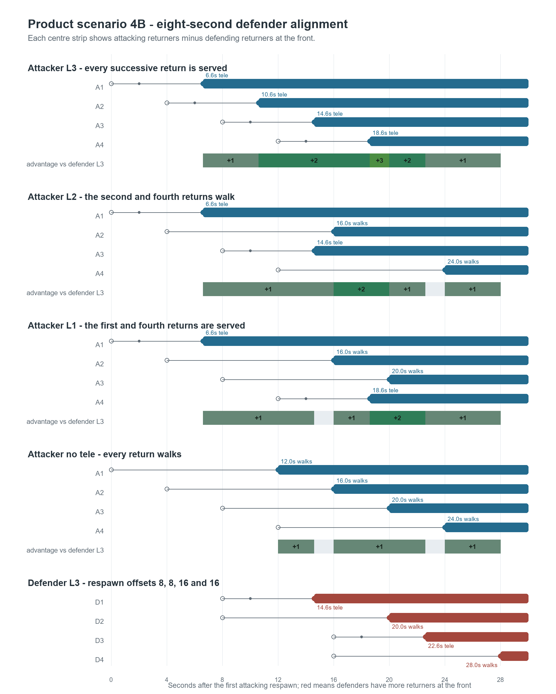

<pagebreak>

### Sensitivity: attacking returns eight seconds apart

The main scenarios use attacking spawn offsets `0, 4, 8, 12` to represent returners arriving on successive attacking waves. This sensitivity instead uses offsets `0, 8, 16, 24`, while preserving defender L3, the Product routes and the four- or eight-second defender alignment. It changes only the spacing between attacking returns.

**Four-second defender alignment.** L3 and L2 each serve every attacking return. L1 serves the first and third returns, while the second and fourth walk.

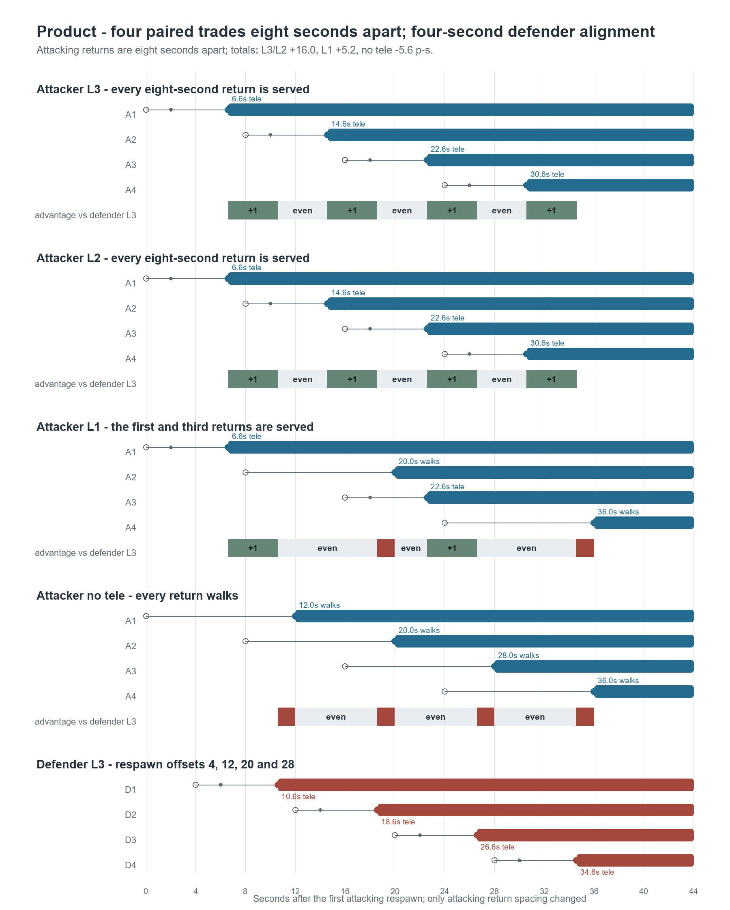

<pagebreak>

### Sensitivity continued: eight-second defender alignment

With eight seconds between attacking returns, L2 recharges in time to serve every rider and therefore matches L3. L1 serves alternate returns, while no-tele rollout remains weaker. The wider spacing removes the +2 and +3 L3 peaks seen in the main four-second-wave scenarios, although L3 and L2 still produce more total front-line presence than L1. This shows that the higher-level teleporter advantage depends partly on how tightly attacking returns cluster.

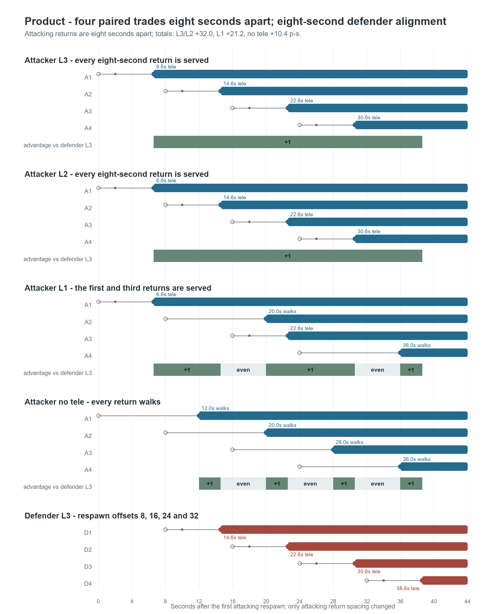

<pagebreak>

## Appendix: complete arrival inputs

These tables expose the per-player front-line arrival values used to calculate every result cell. Times are seconds after the first attacking spawn; `walk` means no-tele rollout. This appendix is for checking the working and can be skipped when reading the argument.

### Product arrival inputs

| Case | Attack spawns | Defence spawns | Defence L3 arrivals | Attack walk arrivals | Attack L1 arrivals | Attack L2 arrivals | Attack L3 arrivals |
|---:|---|---|---|---|---|---|---|
| **1A** | `0` | `4` | 10.6 L3 | 12.0 walk | 6.6 L1 | 6.6 L2 | 6.6 L3 |
| **1B** | `0` | `8` | 14.6 L3 | 12.0 walk | 6.6 L1 | 6.6 L2 | 6.6 L3 |
| **2A** | `0, 4` | `4, 12` | 10.6 L3<br>18.6 L3 | 12.0 walk<br>16.0 walk | 6.6 L1<br>16.0 walk | 6.6 L2<br>16.0 walk | 6.6 L3<br>10.6 L3 |
| **2B** | `0, 4` | `8, 8` | 14.6 L3<br>20.0 walk | 12.0 walk<br>16.0 walk | 6.6 L1<br>16.0 walk | 6.6 L2<br>16.0 walk | 6.6 L3<br>10.6 L3 |
| **3A** | `0, 4, 8` | `4, 12, 12` | 10.6 L3<br>18.6 L3<br>24.0 walk | 12.0 walk<br>16.0 walk<br>20.0 walk | 6.6 L1<br>16.0 walk<br>20.0 walk | 6.6 L2<br>16.0 walk<br>14.6 L2 | 6.6 L3<br>10.6 L3<br>14.6 L3 |
| **3B** | `0, 4, 8` | `8, 8, 16` | 14.6 L3<br>20.0 walk<br>22.6 L3 | 12.0 walk<br>16.0 walk<br>20.0 walk | 6.6 L1<br>16.0 walk<br>20.0 walk | 6.6 L2<br>16.0 walk<br>14.6 L2 | 6.6 L3<br>10.6 L3<br>14.6 L3 |
| **4A** | `0, 4, 8, 12` | `4, 12, 12, 20` | 10.6 L3<br>18.6 L3<br>24.0 walk<br>26.6 L3 | 12.0 walk<br>16.0 walk<br>20.0 walk<br>24.0 walk | 6.6 L1<br>16.0 walk<br>20.0 walk<br>18.6 L1 | 6.6 L2<br>16.0 walk<br>14.6 L2<br>24.0 walk | 6.6 L3<br>10.6 L3<br>14.6 L3<br>18.6 L3 |
| **4B** | `0, 4, 8, 12` | `8, 8, 16, 16` | 14.6 L3<br>20.0 walk<br>22.6 L3<br>28.0 walk | 12.0 walk<br>16.0 walk<br>20.0 walk<br>24.0 walk | 6.6 L1<br>16.0 walk<br>20.0 walk<br>18.6 L1 | 6.6 L2<br>16.0 walk<br>14.6 L2<br>24.0 walk | 6.6 L3<br>10.6 L3<br>14.6 L3<br>18.6 L3 |

### Ashville arrival inputs

| Case | Attack spawns | Defence spawns | Defence L3 arrivals | Attack walk arrivals | Attack L1 arrivals | Attack L2 arrivals | Attack L3 arrivals |
|---:|---|---|---|---|---|---|---|
| **1A** | `0` | `4` | 9.6 L3 | 12.0 walk | 5.6 L1 | 5.6 L2 | 5.6 L3 |
| **1B** | `0` | `8` | 13.6 L3 | 12.0 walk | 5.6 L1 | 5.6 L2 | 5.6 L3 |
| **2A** | `0, 4` | `4, 12` | 9.6 L3<br>17.6 L3 | 12.0 walk<br>16.0 walk | 5.6 L1<br>16.0 walk | 5.6 L2<br>16.0 walk | 5.6 L3<br>9.6 L3 |
| **2B** | `0, 4` | `8, 8` | 13.6 L3<br>20.0 walk | 12.0 walk<br>16.0 walk | 5.6 L1<br>16.0 walk | 5.6 L2<br>16.0 walk | 5.6 L3<br>9.6 L3 |
| **3A** | `0, 4, 8` | `4, 12, 12` | 9.6 L3<br>17.6 L3<br>24.0 walk | 12.0 walk<br>16.0 walk<br>20.0 walk | 5.6 L1<br>16.0 walk<br>20.0 walk | 5.6 L2<br>16.0 walk<br>13.6 L2 | 5.6 L3<br>9.6 L3<br>13.6 L3 |
| **3B** | `0, 4, 8` | `8, 8, 16` | 13.6 L3<br>20.0 walk<br>21.6 L3 | 12.0 walk<br>16.0 walk<br>20.0 walk | 5.6 L1<br>16.0 walk<br>20.0 walk | 5.6 L2<br>16.0 walk<br>13.6 L2 | 5.6 L3<br>9.6 L3<br>13.6 L3 |
| **4A** | `0, 4, 8, 12` | `4, 12, 12, 20` | 9.6 L3<br>17.6 L3<br>24.0 walk<br>25.6 L3 | 12.0 walk<br>16.0 walk<br>20.0 walk<br>24.0 walk | 5.6 L1<br>16.0 walk<br>20.0 walk<br>17.6 L1 | 5.6 L2<br>16.0 walk<br>13.6 L2<br>24.0 walk | 5.6 L3<br>9.6 L3<br>13.6 L3<br>17.6 L3 |
| **4B** | `0, 4, 8, 12` | `8, 8, 16, 16` | 13.6 L3<br>20.0 walk<br>21.6 L3<br>28.0 walk | 12.0 walk<br>16.0 walk<br>20.0 walk<br>24.0 walk | 5.6 L1<br>16.0 walk<br>20.0 walk<br>17.6 L1 | 5.6 L2<br>16.0 walk<br>13.6 L2<br>24.0 walk | 5.6 L3<br>9.6 L3<br>13.6 L3<br>17.6 L3 |

### Teleporter transfer sequence

The **0.6-second transfer allowance** represents the code-driven transfer sequence: roughly 0.10 seconds before sending, 0.25 seconds in receiving/fade-out and 0.25 seconds before release/fade-in. The teleporter then enters its nominal recharge. This is why the model uses rider cycles of 10.6, 5.6 and 3.6 seconds rather than only the nominal 10, 5 and 3-second recharge times.

`READY -> SENDING -> RECEIVING -> RECEIVING_RELEASE -> RECHARGING -> READY`

Activation is separate: the entrance begins sending only when the player standing on it is nearly stationary, below 5 HU/s. The model therefore does not add a fixed "stand on the tele" activation delay. Source: [Valve teleporter implementation](https://github.com/ValveSoftware/source-sdk-2013/blob/master/src/game/server/tf/tf_obj_teleporter.cpp#L36).
